# WeDevelop

<div align="center">

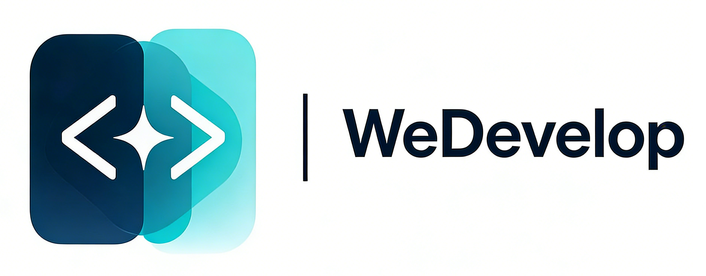

**WeDevelop —— AI 零代码应用生成平台**

[](https://www.oracle.com/java/)
[](https://spring.io/projects/spring-boot)
[](https://vuejs.org/)
[](https://github.com/langchain4j/langchain4j)
[](https://github.com/langchain4j/langchain4j)
[](LICENSE)

[🌐 在线体验](http://wd.weseeworld.cn) • [💻 开源地址](https://github.com/XiaoMaColtAI/WeDevelop)

[特性](#-特性) • [快速开始](#-快速开始) • [技术栈](#-技术栈) • [项目结构](#-项目结构) • [开发指南](#-开发指南) • [API 文档](#-api-文档)

</div>

---

## 📖 项目简介

WeDevelop 是一个基于 **Spring Boot** 和 **LangGraph4j** 的 **AI 零代码应用生成平台**，用户只需输入自然语言提示词，即可一键生成可部署的 **Vue 应用**、**HTML 页面** 或 **多文件代码项目**。平台采用智能工作流编排，支持流式响应，提供完整的用户管理、应用管理和对话历史管理功能，让应用开发像聊天一样简单。

> 💡 **零代码理念**：无需编写任何代码，只需描述你的需求，AI 帮你完成从创意到成品的全过程。

## 🎬 演示

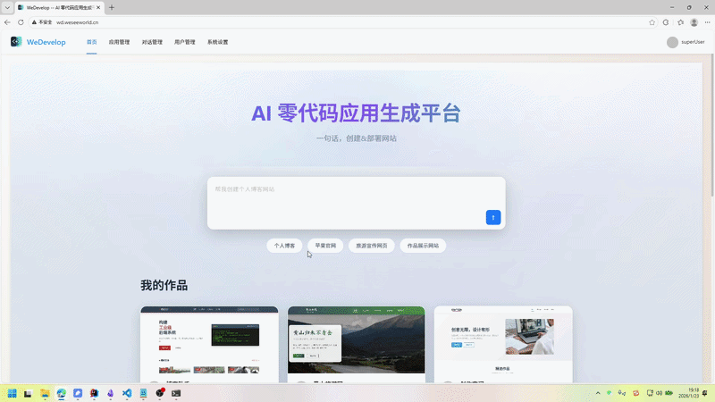

## ✨ 特性

### 🤖 AI 零代码应用生成

| 功能                     | 说明                                               |
| ------------------------ | -------------------------------------------------- |
| **HTML 页面生成**  | 快速生成单页面 HTML 代码，即开即用                           |
| **多文件应用生成** | 支持生成包含多个文件的应用项目                     |
| **Vue 应用生成**   | 一键生成完整的 Vue 3 应用，包含路由、组件等        |
| **流式响应**       | 基于 Server-Sent Events (SSE) 实时返回应用生成进度 |
| **自动部署**       | 生成的应用自动构建并部署到本地服务器 |

### 🔄 智能工作流

基于 LangGraph4j 构建的智能工作流系统，包含以下节点：

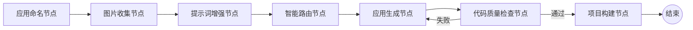

### 👥 用户管理

- 用户注册/登录
- 用户信息管理
- 权限管理（用户/管理员）
- 个人设置

### 📱 应用管理

- 应用创建和编辑
- 应用列表查询
- 应用部署
- 应用代码下载
- 应用截图生成

### 💬 对话管理

- 对话历史保存
- 对话历史查询
- 对话详情查看
- 支持分页和游标查询

## 🛠️ 技术栈

### 后端

| 技术         | 版本      | 说明           |
| ------------ | --------- | -------------- |
| Spring Boot  | 3.5.8     | Java Web 框架  |
| Java         | 21        | 编程语言       |
| LangChain4j  | 1.1.0     | AI 框架        |
| LangGraph4j  | 1.6.0-rc2 | 工作流框架     |
| MyBatis-Flex | 1.11.0    | ORM 框架       |
| Redis        | -         | 缓存 + Session |
| MySQL        | 8.0+      | 数据库         |
| 腾讯云 COS   | -         | 对象存储       |
| Knife4j      | 4.4.0     | API 文档       |
| Hutool       | 5.8.38    | Java 工具库    |

### 前端

| 技术           | 版本    | 说明          |
| -------------- | ------- | ------------- |
| Vue            | 3.5.17  | 渐进式框架    |
| Vite           | 7.0.0   | 构建工具      |
| Ant Design Vue | 4.2.6   | UI 组件库     |
| Vue Router     | 4.5.1   | 路由管理      |
| Pinia          | 3.0.3   | 状态管理      |
| Axios          | 1.11.0  | HTTP 客户端   |
| Highlight.js   | 11.11.1 | 代码高亮      |
| Markdown-it    | 14.1.0  | Markdown 渲染 |

## 📸 项目截图

<table>
  <tr>
    <td align="center"><b>首页</b></td>
    <td align="center"><b>应用管理</b></td>
  </tr>
  <tr>
    <td>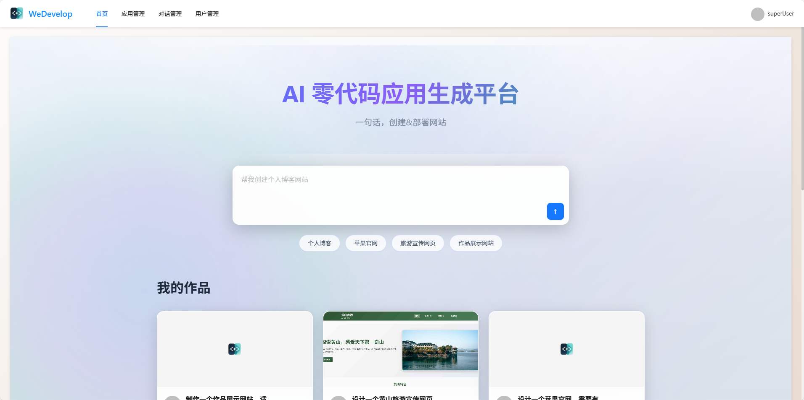</td>
    <td>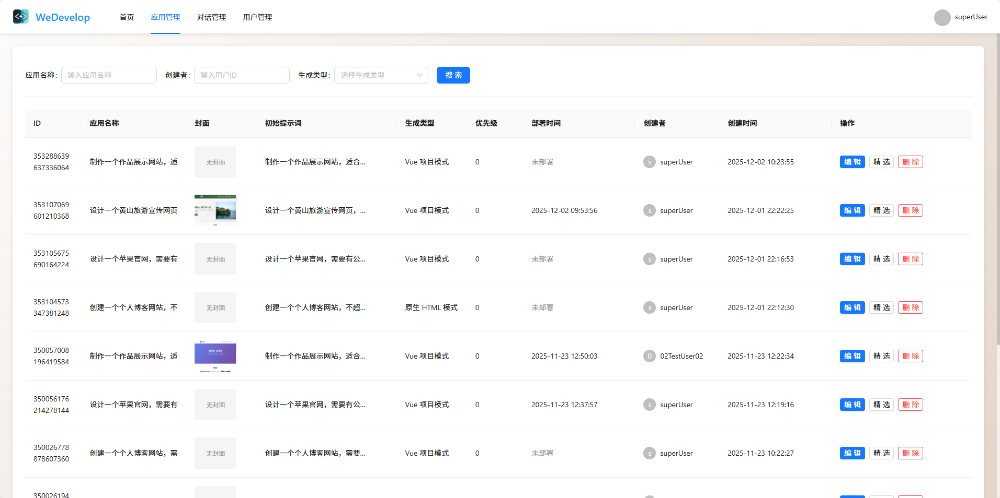</td>
  </tr>
  <tr>
    <td align="center"><b>编辑应用信息</b></td>
    <td align="center"><b>对话管理</b></td>
  </tr>
  <tr>
    <td>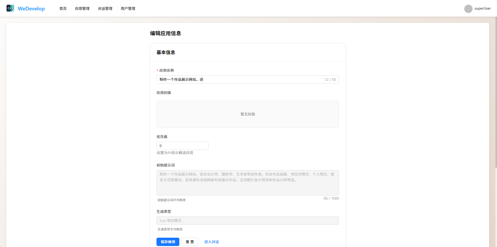</td>
    <td>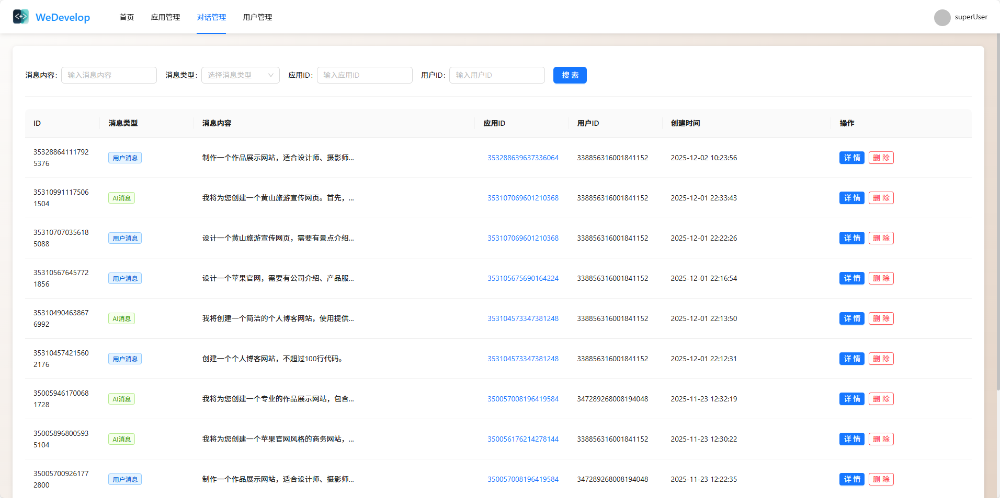</td>
  </tr>
  <tr>
    <td align="center"><b>对话历史详情</b></td>
    <td align="center"><b>用户管理</b></td>
  </tr>
  <tr>
    <td>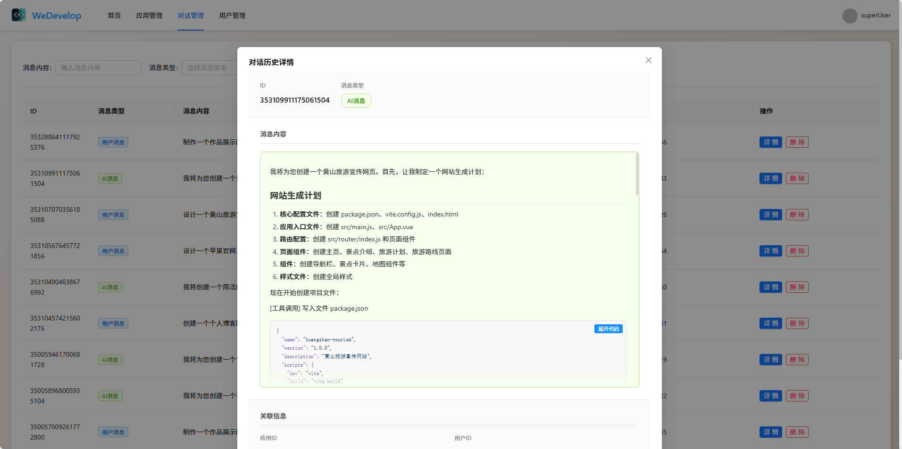</td>
    <td>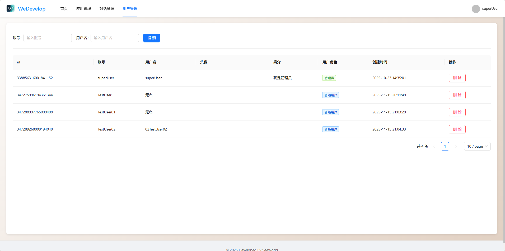</td>
  </tr>
  <tr>
    <td align="center" colspan="2"><b>个人设置</b></td>
  </tr>
  <tr>
    <td align="center" colspan="2">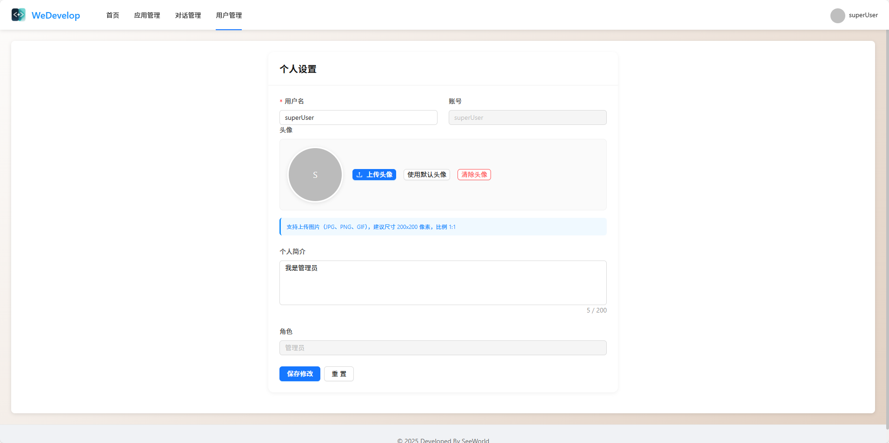</td>
  </tr>
</table>

## 🚀 快速开始

### 环境要求

| 环境    | 版本要求               |
| ------- | ---------------------- |
| JDK     | 21 或更高版本          |
| Maven   | 3.6 或更高版本         |
| Node.js | 18 或更高版本          |
| MySQL   | 8.0 或更高版本         |
| Redis   | 6.0 或更高版本（可选） |

### 后端启动

**1. 克隆项目**

```bash
git clone <repository-url>
cd WeDevelop
```

**2. 数据库初始化**

```bash
mysql -u root -p < sql/init_database.sql
```

**3. 配置文件**

编辑 `src/main/resources/application.yml` 和 `src/main/resources/application-local.yml`，配置数据库连接、Redis 连接等信息。

**4. 启动后端服务**

```bash
# 使用 Maven 启动
mvn spring-boot:run

# 或使用 Maven Wrapper
./mvnw spring-boot:run  # Linux/Mac
mvnw.cmd spring-boot:run  # Windows
```

后端服务默认运行在 `http://localhost:8123/api`

### 前端启动

**1. 进入前端目录**

```bash
cd WeDevelop_frontend
```

**2. 安装依赖**

```bash
npm install
```

**3. 配置环境变量**

根据 `src/config/env.example.ts` 创建 `src/config/env.ts` 文件，配置后端 API 地址。

**4. 启动开发服务器**

```bash
npm run dev
```

前端服务默认运行在 `http://localhost:5173`

**5. 构建生产版本**

```bash
npm run build
```

## 📁 项目结构

<details>
<summary><b>查看完整目录结构</b></summary>

```
WeDevelop/
├── src/                          # 后端源代码
│   └── main/
│       ├── java/
│       │   └── org/example/wedevelop/
│       │       ├── ai/           # AI 服务层
│       │       ├── annotation/   # 自定义注解
│       │       ├── aop/          # 切面处理
│       │       ├── config/       # 配置类
│       │       ├── constant/     # 常量定义
│       │       ├── controller/   # 控制器层
│       │       ├── service/      # 服务层
│       │       ├── core/         # 核心业务层
│       │       ├── exception/    # 异常处理
│       │       ├── generator/    # 代码生成器
│       │       ├── langgraph4j/  # 工作流层
│       │       ├── mapper/       # 数据访问层
│       │       ├── model/        # 数据模型
│       │       └── utils/        # 工具类
│       └── resources/
│           ├── application.yml   # 应用配置
│           ├── mapper/           # MyBatis Mapper XML
│           └── prompt/           # AI 提示词模板
├── WeDevelop_frontend/           # 前端项目
│   └── src/
│       ├── api/                  # API 接口
│       ├── assets/               # 静态资源
│       ├── components/           # 组件
│       ├── config/               # 配置文件
│       ├── layouts/              # 布局组件
│       ├── router/               # 路由配置
│       ├── stores/               # 状态管理
│       ├── utils/                # 工具函数
│       └── views/                # 页面组件
├── sql/                          # SQL 脚本
│   └── init_database.sql         # 数据库初始化脚本
├── img/                          # 项目截图
└── pom.xml                       # Maven 配置
```

</details>

## 🔧 配置说明

### 后端配置

**1. 复制配置文件**

将 `application-local.yml.template` 重命名为 `application-local.yml`：

```bash
# Windows
copy src\main\resources\application-local.yml.template src\main\resources\application-local.yml

# Linux/Mac
cp src/main/resources/application-local.yml.template src/main/resources/application-local.yml
```

**2. 编辑配置文件**

编辑 `src/main/resources/application-local.yml`，配置以下内容：

```yaml
# 数据库配置
spring:
  datasource:
    url: jdbc:mysql://localhost:3306/we_develop
    username: root
    password: root

# Redis 配置
  data:
    redis:
      host: localhost
      port: 6379
      password:
      database: 0

# AI 模型配置（以 DeepSeek 为例）
langchain4j:
  open-ai:
    chat-model:
      base-url: https://api.deepseek.com
      api-key: your-api-key-here  # 替换为你的 API Key
      model-name: deepseek-chat
      max-tokens: 8192
    streaming-chat-model:
      base-url: https://api.deepseek.com
      api-key: your-api-key-here  # 替换为你的 API Key
      model-name: deepseek-chat
      max-tokens: 8192

# Pexels 图片搜索 API Key
pexels:
  api-key: your-pexels-api-key-here  # 替换为你的 API Key

# 服务器配置
server:
  port: 8123
  servlet:
    context-path: /api
```

> 💡 **提示**：生产环境建议使用环境变量或配置中心管理敏感配置。

### 前端配置

配置文件：`WeDevelop_frontend/src/config/env.ts`

```typescript
export default {
  apiBaseUrl: 'http://localhost:8123/api',
  // 其他配置...
}
```

## 🎯 核心功能说明

### 应用生成流程

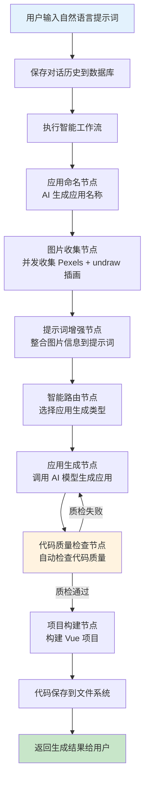

### 工作流架构

平台采用 LangGraph4j 构建状态机工作流，支持：

- ✅ 节点间的状态传递
- ✅ 条件路由和循环
- ✅ 并发节点执行
- ✅ 流式输出

### 流式响应

使用 **Server-Sent Events (SSE)** 实现应用生成的实时反馈：

- 实时显示应用生成进度
- 支持大文件的分块传输
- 提升用户体验

## 🧪 开发指南

> 💡 **提示**：本平台主打零代码应用生成，普通用户无需编写代码即可使用。以下开发指南仅针对希望扩展平台功能的开发者。

### 后端开发

| 模块                   | 说明                                                                                   |
| ---------------------- | -------------------------------------------------------------------------------------- |
| **代码生成服务** | 实现 `AiCodeGeneratorService` 接口，在 `AiCodeGeneratorServiceFactory` 中注册      |
| **工作流节点**   | 实现 `Node` 接口，在 `WorkflowApp` 中注册节点                                      |
| **API 接口**     | 在 `controller` 包下创建控制器，使用 `@RestController` 注解，配置 Swagger 文档注解 |

### 前端开发

| 模块               | 说明                                                                |
| ------------------ | ------------------------------------------------------------------- |
| **页面开发** | 在 `views` 目录下创建 Vue 组件，在 `router/index.ts` 中配置路由 |
| **API 调用** | 在 `api` 目录下定义接口函数，使用 `request.ts` 中的封装方法     |
| **状态管理** | 在 `stores` 目录下创建 Pinia store                                |

## 📝 API 文档

启动后端服务后，访问以下地址查看 API 文档：

| 文档类型               | 地址                                      |
| ---------------------- | ----------------------------------------- |
| **Knife4j 文档** | `http://localhost:8123/api/doc.html`    |
| **Swagger JSON** | `http://localhost:8123/api/v3/api-docs` |

## 🤝 贡献指南

欢迎贡献代码！请遵循以下步骤：

1. Fork 本仓库
2. 创建特性分支 (`git checkout -b feature/AmazingFeature`)
3. 提交更改 (`git commit -m 'Add some AmazingFeature'`)
4. 推送到分支 (`git push origin feature/AmazingFeature`)
5. 开启 Pull Request

## 📄 许可证

本项目采用 **MIT** 许可证。详情请参阅 [LICENSE](LICENSE) 文件。

## 🙏 致谢

- [LangChain4j](https://github.com/langchain4j/langchain4j) - Java 版本的 LangChain
- [LangGraph4j](https://github.com/langchain4j/langchain4j) - 工作流编排框架
- [Spring Boot](https://spring.io/projects/spring-boot) - Java 应用框架
- [Vue.js](https://vuejs.org/) - 渐进式 JavaScript 框架
- [Ant Design Vue](https://antdv.com/) - 企业级 UI 组件库

---

<div align="center">

**⭐ 如果这个项目对你有帮助，请给个 Star ⭐**

</div>
